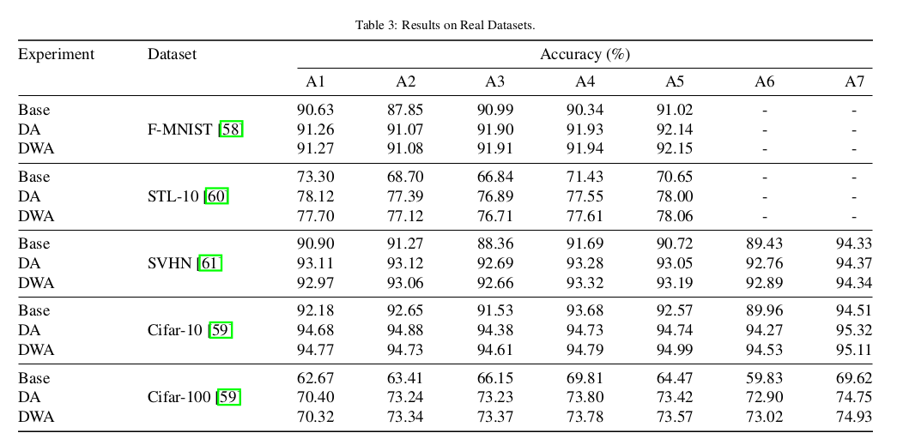
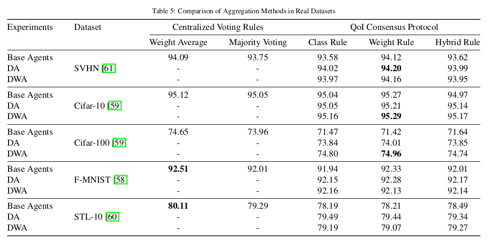

# Quality of Inference (QoI) Consensus Protocol.

This repository was created with the aim of incorporeting a Collaborative and Decentralized structure in a Multi-agent DNN inference scenario. Two methods are presented: an Individualized Agent Decision Aggregation (IADA) method and a Quality of Inference (QoI) censensus protocol. 

Assuming that we operating in a multi-agent enviroment composed of $M$ agents,  each one of them maintain a local pre-trained model of the form $f_i(x)$ and they attempt to achieve collaborative decentralized inference. We assume that they communicating to each other under fixed communication links and the decision making process can be achieved:
* Individualized Agent Decision Aggregation (IADA) Method: In IADA, each agent improve its individual performance by observing and deciding which neighboor agent is going to include in its final decision making process.
* Quality of Inference (QoI) Consensus Protocol: Agents are communicationg directly to each other in order tov reach a consensus about the predictions proposed by each sample, working thus as a single inference rule. [^1]

# Master Thesis

This code was used to implement the experiments of my Master Thesis in Digital Media - Computational Intelligence of School of Informatics in Aristotle University of Thessaloniki. 

# Datasets and Models.
We tested our proposed methods in two type of datasets. Synthetics and Real. The real datasets are: Cifar-10/ Cifar-100/ F-Mnist/ SVHN and Stl-10. The used models are: ResNet 18/52, VGG 10/16, MobileNet, RepVGG, ShuffleNet, DesNet and so on. 

# DNN Version testing.

```shell
python DNN_test.py
```

# Synthetic Version testing.

```shell
python Synthetic_Test.py
```
# Results.
* IADA Method on Real Datasets.



* Quality of Inference Method.



# Author

Feel free to send me a message for any issue.

***Dimitrios Papaioannou (dnpapaion@gmail.gr)***


[^1]: Castro, Miguel. “Practical Byzantine fault tolerance.” USENIX Symposium on Operating Systems Design and Implementation (1999).

